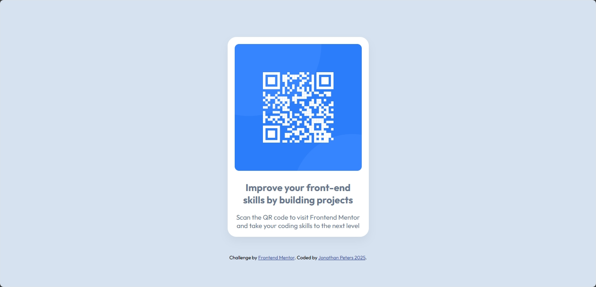
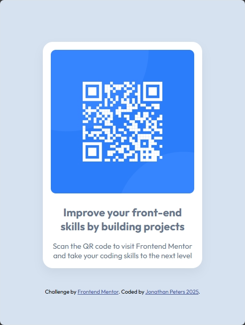

Frontend Mentor - QR code component solution
This is a solution to the QR code component challenge on Frontend Mentor. 
Frontend Mentor challenges help you improve your coding skills by building realistic projects.

QR Code (Desktop View)                                                                               QR Code (Mobile View)

<a href="https://qms85.github.io/QRCode/">                                                           <a href="https://qms85.github.io/QRCode/">                                             
                                            
</a>                                                                                                 </a>


Links:
Solution URL: https://github.com/QMS85/QRCode.git
Live Site URL: https://qms85.github.io/QRCode/

My process
Built with
Semantic HTML5 markup
CSS custom properties
Flexbox
CSS Grid

Here's a step-by-step breakdown of how this QR code component project was completed:

##1. Project Setup:
~ Created basic HTML file structure with proper meta tags and character encoding
~ Added viewport meta tag for responsive design
~ Linked necessary external resources:
~ Outfit font from Google Fonts
~ Custom CSS file
~ Favicon

##2. The provided HTML has the following structure:
~ Built semantic HTML markup using:
~ ```<main>``` for primary content
~ ```<div>``` for QR card container
~ `````` for QR code image
~ ```<h1>``` for main heading
~ ```<p>``` for descriptive text
~ ```<footer>``` for attribution

##3. CSS Base Styling:
```
* {
    margin: 0;
    padding: 0;
    box-sizing: border-box;
}
```
~ Reset default margins and padding
~ Set box-sizing to border-box for consistent layouts

##4. Body Layout:
```
body {
    font-family: 'Outfit', sans-serif;
    background-color: hsl(212, 45%, 89%);
    min-height: 100vh;
    display: flex;
    flex-direction: column;
    align-items: center;
    justify-content: center;
}
```
~ Used flexbox for centering content vertically and horizontally
~ Set minimum viewport height
~ Applied background color and font family

##5. Card Component Styling:
```
.qr-card {
    background-color: hsl(0, 0%, 100%);
    padding: 1rem;
    border-radius: 1.25rem;
    box-shadow: 0 10px 20px rgba(0, 0, 0, 0.05);
    max-width: 320px;
    text-align: center;
}
```
~ Created white card container
~ Added padding, border radius, and subtle shadow
~ Set maximum width for consistent sizing

##6. Responsive Design
~ Added media query for screens 375px and larger
~ Adjusted card margins for better mobile display
```
@media (min-width: 375px) {
    .qr-card {
        margin: 0 auto;
    }
}
```
##7. Typography and Colors
~ Used specific HSL colors for text and backgrounds
~ Set appropriate font sizes and weights
~ Added proper spacing between elements

##8. Final Testing
~ Verified layout on different screen sizes
~ Checked accessibility features (alt text, semantic HTML)
~ Validated HTML and CSS

This project demonstrates responsive design principles, proper HTML semantics, and CSS best practices for creating a simple yet effective component.

##The Challenges i faced with this project:

Here are the main challenges faced in this QR code component project:

##1.Centering the Card Component
~ Challenge: Achieving perfect vertical and horizontal centering
~ Solution: Used flexbox on the body element:
```
// filepath: /workspaces/QRCode/styles.css
body {
  display: flex;
  flex-direction: column;
  align-items: center;
  justify-content: center;
  min-height: 100vh;
}
```

##2. Image Responsiveness
~ Challenge: Making the QR code image scale properly within its container
~ Solution: Added responsive image properties:
```
// filepath: /workspaces/QRCode/styles.css
.qr-image {
  width: 100%;
  border-radius: 0.625rem;
}
```

##3. Typography Balance
~ Challenge: Maintaining readable text sizes across devices
~ Solution: Used relative units and specific font weights:
```
// filepath: /workspaces/QRCode/styles.css
h1 {
  font-size: 1.375rem;
  font-weight: 700;
  margin: 1.25rem 0;
}

p {
  font-size: 0.9375rem;
  font-weight: 400;
  color: hsl(220, 15%, 55%);
}
```

##4. Card Shadow Effects
~ Challenge: Creating subtle, realistic shadow effects
~ Solution: Used carefully tuned box-shadow values:
```
// filepath: /workspaces/QRCode/styles.css
.qr-card {
  box-shadow: 0 10px 20px rgba(0, 0, 0, 0.05);
}
```

##5. Mobile Responsiveness
~ Challenge: Ensuring the component looks good on all screen sizes
~ Solution: Used a mobile-first approach with appropriate max-width constraints:
```
// filepath: /workspaces/QRCode/styles.css
.qr-card {
  max-width: 320px;
  margin: 1.25rem;
}
```

These challenges were overcome through careful planning, testing across different screen sizes, and implementing responsive design best practices.

What I have learned

Here are the key learnings from this QR code component project:

##1. Semantic HTML Structure
~ Learned the importance of using semantic elements like ```<main>``` and ```<footer>```
~ Proper use of heading hierarchy with ```<h1>```
~ Adding meaningful alt attributes for accessibility

##2. CSS Best Practices
~ Using CSS custom properties for better maintainability:
```
:root {
  --white: hsl(0, 0%, 100%);
  --light-gray: hsl(212, 45%, 89%);
  --grayish-blue: hsl(220, 15%, 55%);
  --dark-blue: hsl(218, 44%, 22%);
}
```

##3. Flexbox Layout
~ Understanding flexbox for centering content both vertically and horizontally
~ Using flex properties effectively:
```
.container {
  display: flex;
  justify-content: center;
  align-items: center;
  min-height: 100vh;
}
```

##4. Responsive Design
~ Mobile-first approach importance
~ Using relative units (rem) instead of fixed pixels
~ Implementing proper viewport meta tags

##5. Project Organization
~ Keeping code clean and well-structured
~ Separating concerns (HTML structure, CSS styling)
~ Proper file organization (images in separate folder)

##6. Version Control
~ Using Git/Github for tracking changes
~ Creating meaningful commit messages
~ Managing project files effectively

##7. Performance Considerations
~ Optimizing images
~ Using appropriate font loading strategies
~ Minimizing CSS complexity
~ These learnings contribute to better frontend development practices and more maintainable code.

After completing this QR code project, here are some areas for continued developement or further study:

##1. Advanced CSS Features
~ Study CSS Grid for more complex layouts
~ Learn CSS animations and transitions
~ Explore CSS custom properties (variables) in depth

##2. JavaScript Integration
~ Add interactive features:
~ Loading states
~ Dynamic QR code generation
~ Form validation

##3. Accessibility Improvements
~ Learn ARIA attributes
~ Implement keyboard navigation
~ Study color contrast requirements

##4. Build Tools & Optimization
~ Learn package managers (npm/yarn)
~ Study build tools like Webpack or Vite
~ Implement CSS preprocessing with Sass/Less

##5. Testing
~ Unit testing with Jest
~ E2E testing with Cypress
~ Accessibility testing tools

##6. Version Control
~ Advanced Git features
~ Branching strategies
~ Pull request workflows

##7. Performance Optimization
~ Image optimization
~ Lazy loading
~ Critical CSS implementation
  
##8. Responsive Design
~ Mobile-first approach
~ CSS media queries
~ Fluid typography


Author: Jonathan Peters
Website - https://qms85.github.io/MyPortfolio/
Frontend Mentor: https://www.frontendmentor.io/profile/QMS85
Twitter - @DJJonnas85
Facebook: https://www.facebook.com/2jonathanpeters
Linkedin: https://www.linkedin/in/2jonathanpeters


